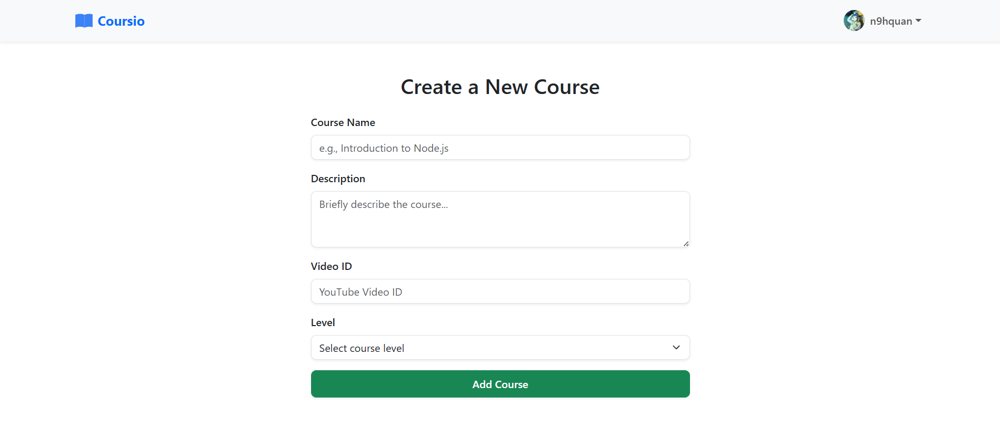
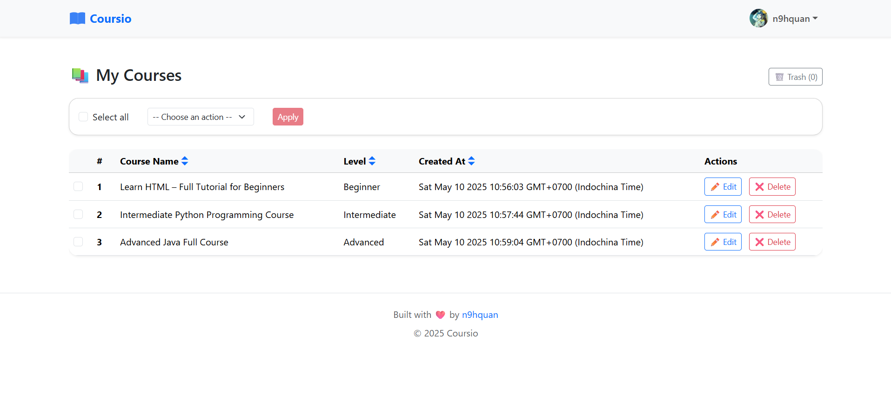

# Coursio
Coursio is a web application designed to simplify course management for educators and administrators. 
It provides intuitive interfaces and robust features to create, edit, and delete courses, 
ensuring seamless management of educational content.
## Features
- Manage courses: Create, edit, and delete courses easily.
- User-friendly UI: Clean interface for smooth interaction.
- Data storage: Store and manage course data with MongoDB.
## Folder Structure
```bash
coursio/
├── src/
│ ├── app/ # Application logic (MVC controllers, models, middlewares)
│ │ ├── controllers/
│ │ │ ├── CourseController.js
│ │ │ ├── MeController.js
│ │ │ └── SiteController.js
│ │ ├── middlewares/
│ │ │ └── SortMiddleware.js
│ │ ├── models/
│ │ │ └── Course.js
│ ├── config/ # Configuration files
│ │ └── db/
│ │     └── index.js 
│ ├── public/ # Public assets
│ │ ├── css/
│ │ │ ├── app.css
│ │ │ └── app.css.map
│ │ └── vendor/
│ ├── resources/ # Static resources and views
│ │ ├── scss/
│ │ │ ├── _variables.scss
│ │ │ └── app.scss
│ │ └── views/
│ │ │ ├── courses/
│ │ │ │ ├── create.hbs
│ │ │ │ ├── edit.hbs
│ │ │ │ └── show.hbs
│ │ │ ├── layouts/
│ │ │ │ └── main.hbs
│ │ │ ├── me/
│ │ │ │ ├── stored-courses.hbs
│ │ │ │ └── trash-courses.hbs
│ │ │ ├── partials/
│ │ │ │ ├── header.hbs
│ │ │ │ └── footer.hbs
│ │ │ └── home.hbs
│ ├── routes/ # Application routes
│ │ ├── courses.js
│ │ ├── index.js
│ │ ├── me.js
│ │ ├── site.js
│ ├── util/ # Utilities
│ │ └── mongoose.js
│ └── index.js # App entry point
├── .gitignore
├── nodemon.json
├── package-lock.json
├── package.json
└── README.md
```
## Installation
1. Clone the repository
```bash
git clone https://github.com/n9hquan/coursio.git
cd coursio
```
2. Install dependencies
List of dependencies: 
- express
- express-handlebars
- method-override
- mongoose
- mongoose-delete
- mongoose-sequence
- mongoose-slug-generator
For dev dependencies:
- husky
- lint-staged
- morgan
- nodemon
- prettier
- sass
3. Download MongoDB Compass and create a connection to the database that includes courses. 
## Commands
To start the server, run:
```bash
npm start
```
To watch for changes in your SCSS files and see live updates, run:
```bash
npm run watch
```
## Usage
Here are some basic routes to get started with:
- Home page: http://localhost:3000
- Create a new course: http://localhost:3000/courses/create
- See stored courses: http://localhost:3000/me/stored/courses
## Screenshots


